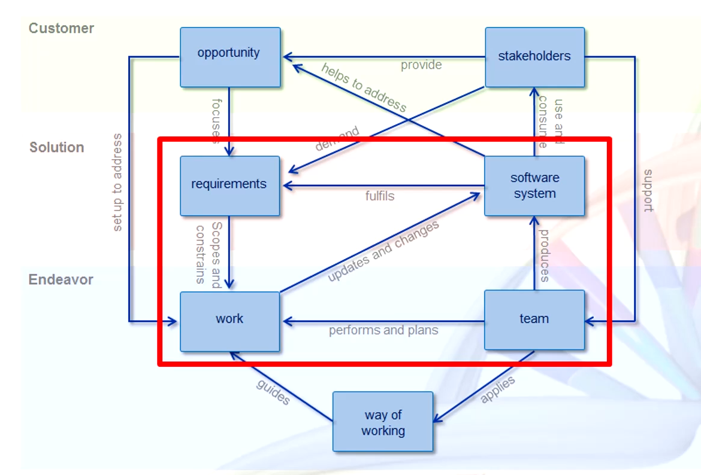
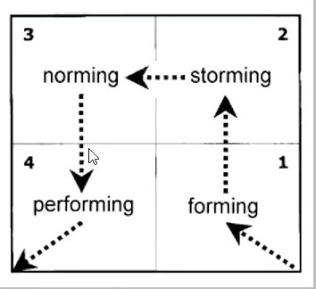
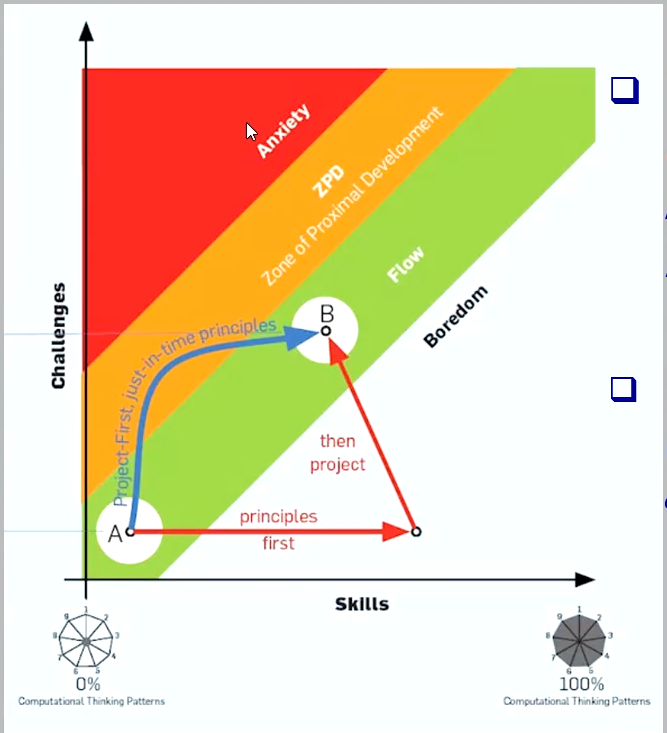

# T1: Introduzione

## Introduzione

### Cosa viene affrontato nel corso? 

In questo corso apprenderemo metodi e pratiche di lavoro alla base della professione informatica:
1. *Gestire il tempo*: disponibilità, scadenze, conflitti, priorità;
2. *Collaborare*: fissare obiettivi, dividersi i compiti, verificare progressi, riportare difficoltà;
3. *Assumersi responsabilità*: concludere quanto pattuito, agire al meglio delle proprie capacità, auto-valutarso prima di valutare;
4. *Auto-apprendere*: "imparare ad imparare" e competenze trasversali.

Per fare cio' terremo un **glossario**, il quale fungerà da:
- Raccolta di termini/concetti centrali al dominio SWE e non auto-evidenti;
- Registrati in modo da facilitarne la localizzazione;
- Corredati dalla nostra personale specifica del loro significato e ogni altra informazione utile a riconoscerli

## Progetto

Definiamo progetto come un insieme di attività che: 
- Devono raggiungere determinati obiettivi a partire da determinate specifiche;
- Hanno una data d'inizio e una data di fine fissate;
- Dispongono di risorse limitate (persone, tempo, denaro, strumnenti,..);
- Consumano tali risorse nel loro svolgersi.

L'outcome di un progetto è un prodotto composito:
- SW sorgente/eseguibile, librerie, documenti, manuali.

### Principali costituenti di un progetto

Sono le 4 che seguono:
- *Pianificazione*: gestire risorse (persone, tempo, denaro, strumenti) responsabilmente, in funzione degli obiettivi;
- *Analisi dei requisiti*: definire **cosa** bisogna fare;
- *Progettazione (Design)*: definire **come** farlo;
- *Realizzazione*:
    - Farlo perseguendo la qualità;
    - Accertando l'assenza di errori od omissioni;
    - Accertando che i risultati soddisfino le attese;

Per capire cosa non è un progetto:

" One is blinded to the fundamental uselessness of their products, by the sense of achivement one feels in getting them to work at all. ", " In other words, their fundamental design flaws are completely hidden by their superficial desgin flaws. "

Da questa rappresentazione capiamo che un progetto si puo' suddividere secondo 3 strati: Endeavor (sforzo), Solution (soluzione) e Customer (cliente);

Alla base di un progetto c'è un triangolo contentente: **Work** (del lavoro), **Team** (una squadra) che poggiano sulle fondamenta cioè il **Way of Working** (il modo che abbiamo di lavorare).

Il **lavoro**, a sua volta ha come fine e come limiti i dettami derivanti dai **Requirements** (requisiti): il **lavoro** del **team** seguendo i **requisiti** produce un Software System (SW sorgente/eseguibile);

Questi 4 concetti sono alla base di un progetto software, ma un progetto nasce se fuori da esso sono presenti due cose:
- *Opportunity* (opportunità): qualcuno che necessita del nostro progetto (ad esempio un vero cliente) o l'intuizione che ci sarà un cliente se quel progetto esisterà;
- *Stakeholders* (portatore di interesse/investitori): chi paga, chi vende, chi regolamenta o chi usa.

## Teamwork

Il **Teamwork** è lavoro collaborativo che punta a raggiungere un obiettivo comune in modo efficace ed efficiente.

I membri del team sono inter-dipendenti; 

La gestione di questa inter-dipendenza richiede il rispetto di regole e buone pratiche:
- *Comunicazioni aperte e trasparenti*: risoluzione dei conflitti;
- *Costruzione e preservazione della fiducia reciproca*: condivisione e collaborazione
- *Assunzione di responsabilità*: coordinamento
- *Condivisione dei rischi*

Alla base del **Teamwork** troviamo un solido **Way of Working**.

## Ingredienti

### Engineering

Per svolgere un progetto potendo confidare nel suo successo serve ingegneria:
- *Applicazione* (non creazione!): di principi noti e autorevoli **best practices**;
- *Practical ends*: spesso civili e sociali, associati a responsabilità etiche e professionali;

### Software Engineering

Per quanto riguarda la **Software Engineering**:
- Disciplina per la realizzaizone di **prodotti SW** cosi impegnativi da richiedere il dispiego di attività collaborativve;
- Capacità di produrre "in grande" ed "in picccolo";
- Garantendo qualità: **efficacia**;
- Contenendo il consumo di risorse: **efficienza**;
- Lungo l'intero periodo di sviluppo e di uso del prodotto: **ciclo di vita**;

## SWE rispetto a se stessa

Un sistema SW è tanto più utile quanto più è usato:
- **Metrica**: integrale del suo uso (o del suo #utenti) nel tempo;

Più lunga la vita d'uso di un prodotto, maggiore il suo costo di **manutenzione**;

Il costo di manuntenzione ha varie componenti:
- mancato guadagno;
- perdita di reputaizone;
- recupero o recultamento di esperti;
- sottrazione di risorse ad altre attività;

I principi SWE puntano ad abbassare tali costi sviluppando SW più facilmente manutenibili.

### Ingegneria del Software

L'ingengeria del software raccoglie, organizza, consolida la conoscenza (**body of knowledge**) necessaria a realizzare progetti SW con efficacia ed efficienza tramite collezione e manutenzione migliorative di best practices.

In pratica, applicare principi ingegneristici calati nella produzione del SW;

**Ingegneria del software**: è un approccio sistematico, discilinato e quantificabile allo sviluppo, l'uso, la manutenzione ed il ritiro del SW:
- **Sistematico**:
    - modo di lavorare metodico e rigoroso;
    - che conosce, usa ed evolve le best practice di dominio;
- **Disciplinato**: segue le regole che si è dato;
- **Quantificabile**: permette di misurare l'efficienza e l'efficacia del suo agire;

## Cosa facciamo in questo corso e come lo facciamo

Studiamo tutte le attività di un progetto, proviamo a metterle in pratica in un progetto didattico e verifichiamo il grado di apprendimento in due modi:
- In itinere: tramite revisioni di avanzamento;
- In fine: tramite una prova scritta;

In genere gli studenti acquisiscono skills metodiche attraverso la risposta a delle sfide.

La zona migliore è il flow dove troviamo l'equilibrio fra i principi che mi vengono offerti e le sfide che mettono alla prova quei principi.

L'approccio **project-first just-in-time-principles** riside nella ZPF (Zone of Proximal Flow) che è la condizione ideale per l'apprendimento.

### Argomenti trattati
- Processi, ciclo di vita e modelli di sviluppo del SW;
- Gestione di progetto;
- Amministrazione IT;
- Analisi dei requisiti:
    - UML: diagrammi dei casi d'uso;
- Progettazione:
    - UML: diagrammi delle classi e dei package;
    - UML: diagrammi di sequenza e di attività;
    - Design pattern: creazionali, comportamentali, architetturali;
    - Stili architetturali;
    - Principi SOLID;
- Documentazione;
- Qualità;
- Verifica e validazione;