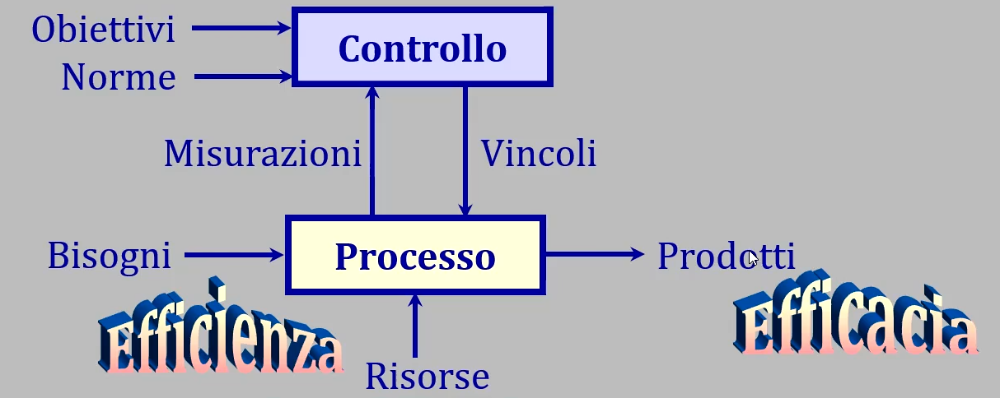
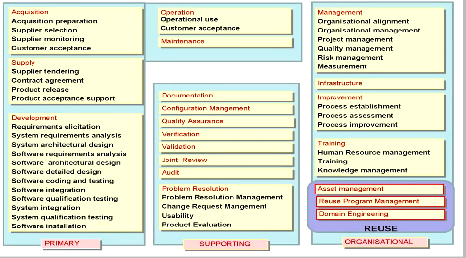
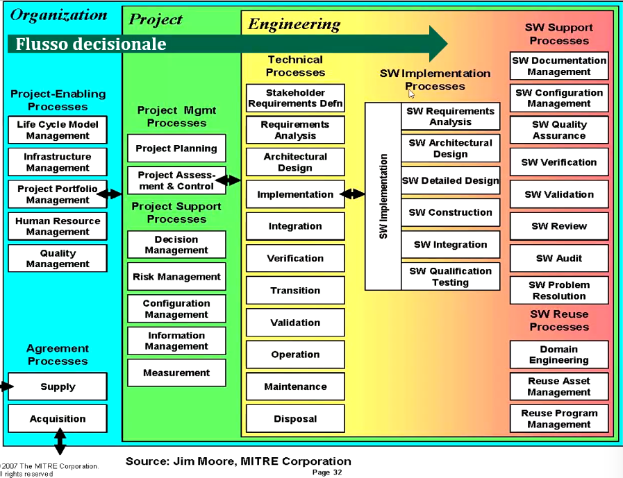
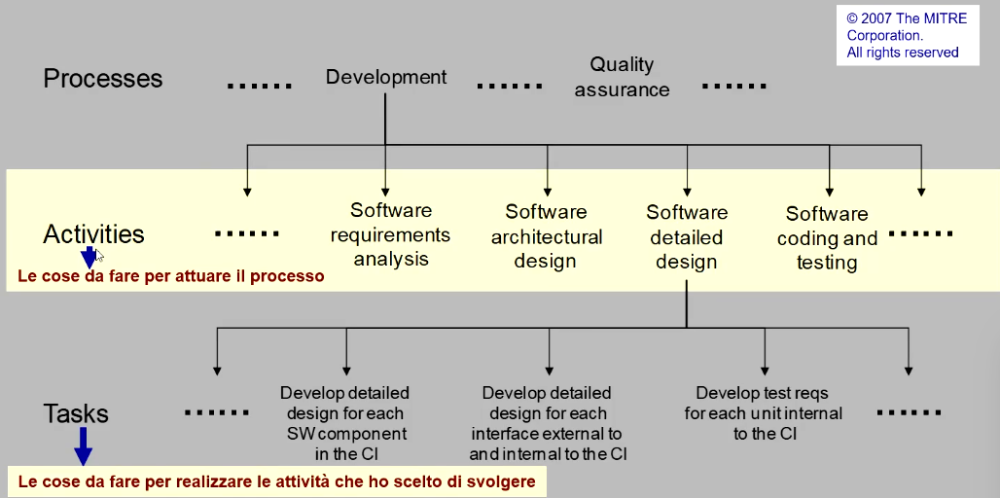
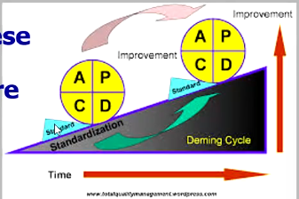

# T2: Processi di ciclo di vita

## Premesse

Cio' che è sotto manutenzione ha una storia che va gestita con un **controllo di versione** che aiuta a nnon perderla e a poter avanzare da o retrocedere ad essa.

Un prodotto SW non è un monoliote ma un insieme di parti:
- perche questo semplifica lo svviluppo e la manutenzione;
- quali siano tali parti e come esse stanno insieme è detto **configurazione**;
- ogni sistema fatto di parti va gestito con un **controllo di configurazione**, integrato con **controllo di versione**; 

## Ciclo di vita del SW

Conviene vederlo come un automa a stati finiti:
- *Stato*: il grado di maturazione raggiunto dal prodotto SW \
    Concezione (analisi dei requisiti) -> sviluppo (design, realizzazione) -> utilizzo -> ritiro
- *Arco* (transizione di stato): l'insime di attività svolte sul prodotto SW per cambiare il suo stato 

Quali e quanti siano gli stati e quali regole attivino o abilitino gli archi (pre e post-condizioni) dipende da:
- obblighi (vincoli contrattuali);
- impegni (way of working);
- opportunità;

*Il compito di un progetto SW è "spingere" un prodotto SW attraverso un dato segmento di ciclo di vita.*

## Il concetto di processo

**Processo**: insieme di attività **correlate** e **coese** che trasformano ingressi (bisogni) in uscite (prodotti) secondo regole date consumando risorse nel farlo.

Un insieme di attività è **efficiente** quando fa quel che deve fare non sprecando risorse: 
- Metrica: **produttività** (es. efficienza produttiva) che è il rapporto tra quantità di prodotto realizzato e risorse utilizzate;

Un insieme di attività è **efficace** quando raggiunge gli obiettivi attesi:
- Metrica: grado di raggiungimento degli obiettivi interni (fornitore) o esterni (gradimento del cliente/utenti);

Il compito di un *progetto* è spingere un prodotto SW attravvertso un dato segmento del suo ciclo di vita;

I *processi* (di ciclo di vita) specificano quali atrtività svolgere per attuare corrette transizioni di stato in modo efficiente ed efficace.

Lo svolgimento di un **progetto** attua un insieme organico di **processi**.

## Standard di processo

Adottare **standard** di processo aiuta a raggiungere l'economicità:
- Standard generali:
    - ISO/IEC 12207: modello di riferimento del dominio SWE;
- Standard settoriali:  
    - IEC 800: settore nucleare;
    - RTCA DO-178: settore aeronautico;
    - ECSS E40: settore spaziale;

Gli standard di processo hanno due funzioni specifiche:
1. Modello esemplare di azione:
    - fissa quali attività svolgere e come farlo (visione prescrittiva);
    - specifica cosa serva fare, lasciando liberà di specializzazione (visione descrittiva);
2. Modello di valutaizione;
    - identificano *best practice* di riferimento;
    - misurano il *way of working* del fornitore rispetto ad esse;

### ISO/IEC 12207

Ha natura descrittiva ed applica a "nessun dominio" ma permette di capire che cosa serve per fare SW.

Identifica i processi di ciclo di vita del SW, ha struttura che richede specializzazione, specifica le responsabilità sui processi ed identifica i prodotti dei processi.

### Processi primari

Come vediamo dalla tabelle precedente, un progetto è tale se e solo se in esso sono attivi processi primari:
- Acquisizione (gestione dei propri sotto-fornitori);
- Fornitura (gestione del rapporti con il cliente);
- Sviluppo;
- Gestione operativa/utilizzo (installazione ed erogazione dei prodotti e/o servizi);
- Manutenzione (correzione, adattamento, evoluzione);

### Processi di supporto 

I processi di supporto stanno ai procesi primari come le procedure di un programma stanno al *main* \
Alcuni esempi:
- Documentazione;
- Gestione della configurazione;
- Accertamento della qualità;
- Verifica;
- Validazione;
- Revisioni congiunte con il cliente;
- Verifiche ispettive interne;
- Risoluzione dei problemi (gestione dei cambiamenti);

### Processi, aziende, progetti

1. Processo *standard*:
    - riferimento di base generico;
    - condiviso tra aziende diverse senza distinzione di dominio applicativo;
2. Processo definito:
    - specializzazione di processo *standard* per azienda o dominio;
    - per adattarlo a esigenze e caratteristiche specifiche;
3. Processo di progetto:
    - istanziazione di processi definiti al caso di uno specifico progetto;
    - utilizza risorse aziendali per raggiungere obiettivi prefissati e limitati al tempo di vita del progetto;

### Specializzazione di processi

Fattori di specializzazione:
- dimensione e complessità del processo;
- rischi: nel dominio applicativo, nel rapporto con clienti e utenti, nella maturità/complessità delle tecnologie in uso, ecc..;
- competenza ed esperienza delle risorse umane;

Associare ai processi un **sistema di qualità** aiuta a migliorarli e a garantire conformità:
- **Maturità**: qualità misurata delle prestazioni;
- **Conformità**: adesione alle aspettative e agli obblighi;

### Buona organizzazione di processo 

Tutto parte dal **continuous improvement** o **principio di miglioramento continuo** (PDCA) che prevede:
- Pianificare (*Plan*): pianifica attività, scadenze, responsabilità, risorse utili a raggiungere specifici obiettivi di miglioramento;
- Eseguire (*Do*): eseguire le attività secondo P;
- Valutare (*Check*): vverificare l'esito delle azioni di miglioramento rispetto alle attese;
- Agire (*Act*): consolidare il buono e cercare modi per migliorare il resto.

### Processi e modelli di ciclo di vita

Il ciclo di vita scelto dermina quali processi attivare.

Il livello di coinvolgimento del cliente determina la natura, funzione e collocazione dei porocessi di **revisione** necessari; inoltre esso determina l'intensità della documentazione, della verifica e della validazione.

Quando il prodotto SW è a parte di un sistema complesso, il modello di ciclo di vita a **livello sistema** (HW, SW ed altri apparati è spesso sequenziale).

Ma quindi, quale ciclo di vita adottare?
Ad influenzare la scelta del ciclo di vita di un progetto sono i seguenti punti:
- cosa vuole il committente:
    - versione unica non modificabile (one-off);
    - versione destinata a continue evoluzioni;
- dipendenze da terze parti ;
- coinvolgimento del committente nello stato di avanzamento:
    - revisioni interne o esterne (solo durante la stesura dei requisiti);
    - bloccanti o non bloccanti;
- richiesta/utilità di fornitura di evidenza di **fattibilità** tramite:
    - sviluppi prototipali (usa e getta, oppure da mantenere ed evolvere);
    - studi ed analisi preliminari (precedenti l'autorizzazione allo sviluppo);

