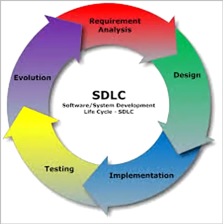
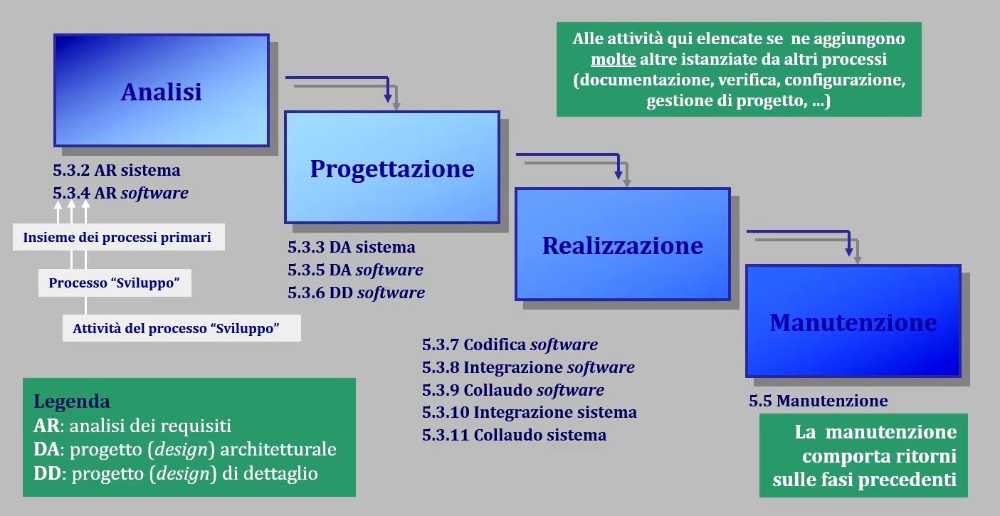

# T3: Ciclo di vita del SW

## Il concetto di "ciclo di vita"

Partiamo da: Concezione -> Sviluppo -> Utilizzo -> Ritiro ma nel corso ci occuperemo principalmente su concezione -> sviluppo.

La transizione fra questi stati avviene tramite l'esecuzione di attività di processi di ciclo di vita, che prevedono specifiche responsabilità da cui definiamo dei **ruoli** in un team di progetto.

Lo stazionamento in uno stato/transizione si dice **fase**: "fase" designa un segmento temporale contiguo con caratteristiche coerenti;

Aderire ad un modello comporta vincoli su pianificazione e gestione del progetto: la scelta del modello di ciclo di vita inluenza la selezione del *way of working* e dei suoi strumenti di supporto;

## Modelli di ciclo di vita

Esistono molteplici cicli di vita che differiscono per transizioni tra stati e regole di attivazione, l'esempio che segue mostra un ciclo di vita che non prevede "Ritiro":

Come vi sono modelli di ciclo di vita, vi sono anche **modelli di sviluppo**;

### Cosa significa "Modello" ?

Definiamo **Modello**: un insieme di specifiche che descrivono un fenomeno di interesse (astratto/concreto) in modo oggettivo, non dipendente dall'osservatore e dimostrato corretto empiricamente o per teorema;

I modelli aiutano a studiare, comrpendere, misurare, trasformare l'oggetto di interesse:
- il modello specifica *cosa* esso sia;
- l'architettura interna (design) specifica *come* esso funzioni;
- l'analisi specifica *perchè* fa quel che fa e come lo fa;

### Evoluzione dei modelli di sviluppo

Il non-modello per eccellenza è il *code-n'-fix* delle origini (o cowboy coding) che portava con se un insieme di attività senza organizzazione preordinata;

Questo indusse alla nascita della SWE e di modelli organizzati:
- **Cascata**: rigide fasi sequenziali;
- **Incrementale**: relizzazione in più passi;
- **Evolutivo**: ripetute iterazione che rilasciano diverse varianti di prodotto;
- **A componenti**: orientato al riuso;
- **Agile**: altamente dinamico, fatto di brevi cicli iterativi e incrementali;

### Modello sequenziale "a cascata"

Si basa sulla produzione industriale centrato sull'idea di *processi ripetibili*; 

Richiede la successione di *fasi rigidamente sequenziali*, non ammette il ritorno a fasi precedenti (se non per eventi eccezionali che riportano all'inizio) da cui ne deriva il nome "a cascata". \
Le iterazioni costano troppo e non vengono viste come buon mezzo di mitigazione delle incertezze di sviluppo;

Prodotti: principalmente *documenti*, fino a poi includere il SW;

L'ingresso in uno stato è condizionato da *pre-condizioni* (gate) che sono le *post-condizioni* delle corrispondenti transizioni; \
E' diviso in fasi distinte e non sovrapposte nel tempo: modello adatto allo sviluppo di sistemi complessi anche sul piano organizzativo.

Ogni fase (stato o transizione) viene definita in termini di:
- Attività previste e prodotti atteso in ingresso ed in uscita;
- Contenuti e struttura dei documenti;
- Responsabilità e ruoli coinvolti;
- Scadenze di consegna dei prodotti;

Entrare, uscire, stazionare in una fase comporta lo svolgimento di determinate azione realizzate come attività erogate da specifici processi.

Critiche:
- Eccessiva rigidità;
- Stretta sequenzialità: nesun parallelismo e nessun ritorno;
- Non ammette modifiche nei requisiti in corso d'opera;
- Visione rigida (burocratica) e poco realistica del progetto.

Correttivi:
- Prototipi di tipo "usa-e-getta":
    - per capire meglio i requisiti o le soluzioni;
    - strettamente all'interno di singole fasi;
- Cascata con ritorni: ogni ciclo di ritorno raggrupa sotto-sequenze di fasi;

### Ritorni: iterazione o incremento?

Puo spesso capire di trovare *stakeholders* che non hanno le idee chiare, per aiutarli possiamo procedere:
- Iterando (potenzialmente distruttive): per problemi particolarmente complessi che richiedono di procedere a tentoni;
- Incrementando:
    - posticipare l'integrazione delle parti del sistema è rischioso 
    - se le cose vanno male restiamo con nulla in mano (*big-bang integration*)
    - meglio l'**i**ntegrazione continua**

In generale iterazione ed incremento coincidono quando la sostituizione raffina ma non ha impatto sul resto

### Vantaggi dei modelli incrementali

1. Possono produrre valore ad ogni incremento:
    - un insieme di funzionalità diventa presto disponibile;
    - i primi incrementi possono essere frutto di prototipazione aiutando a fissare meglio i requisiti per gli incrementi successivi;
2. Ogni incremento riduce il rischio di fallimento (non lo azzera!)
3. Le funzionalità fondamentali vanno sviluppate prima:
    - cosi che esse siano più frequentemente verificate e diventando via via più stabili

25.54